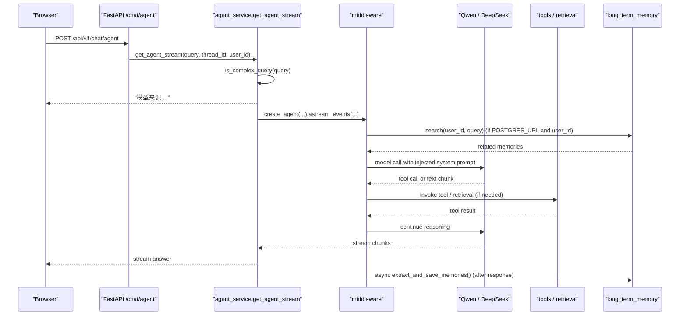
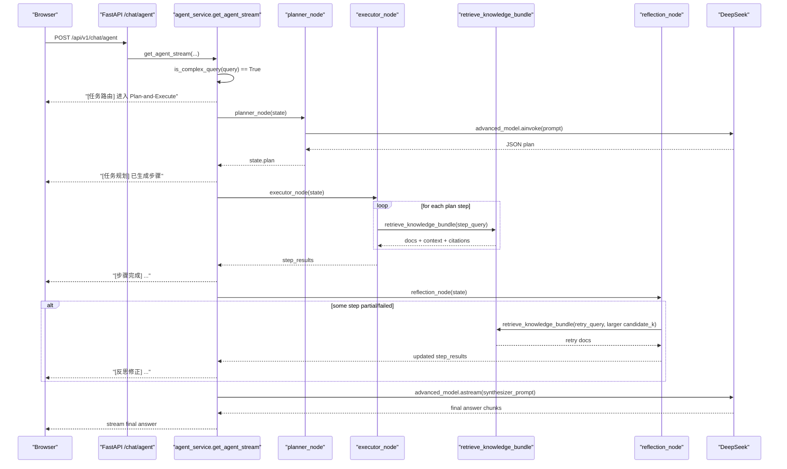
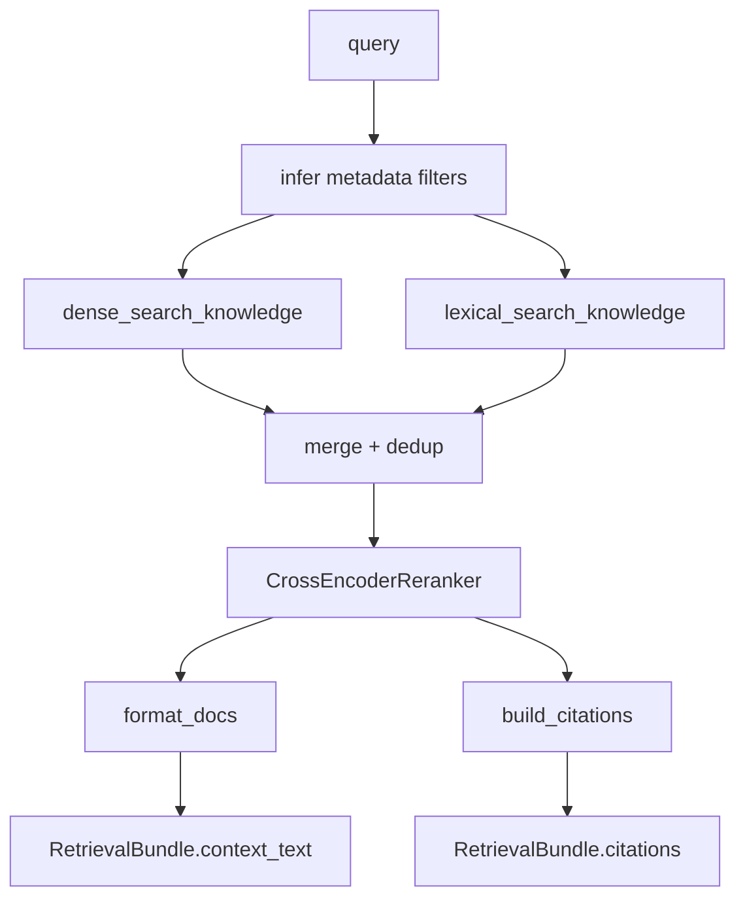
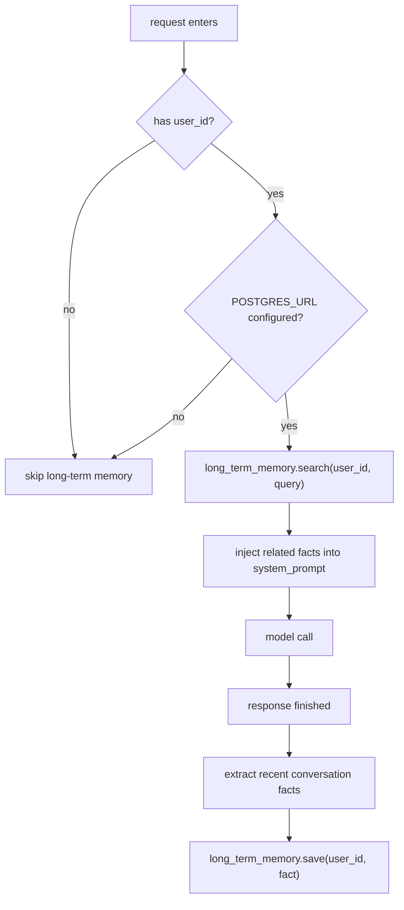
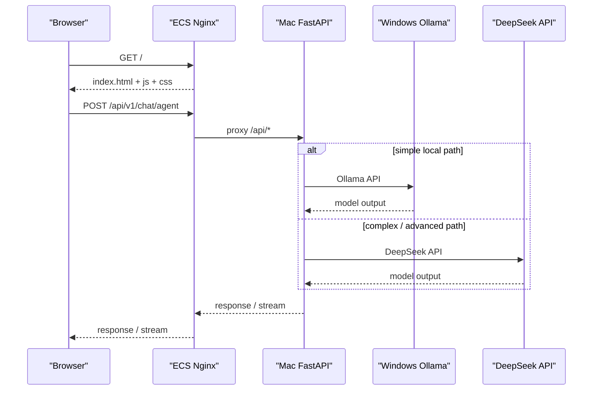

# Local Agent API 完整技术文档

> 面向学习、面试、复盘和继续开发的完整说明  
> 本文档以当前代码实现为准，不再停留在“目标架构”层面。

## 目录

- [1. 项目概览](#1-项目概览)
- [2. 目标场景与系统定位](#2-目标场景与系统定位)
- [3. 当前整体架构](#3-当前整体架构)
- [4. 请求链路总览](#4-请求链路总览)
- [5. 执行模式：ReAct 与 Plan-and-Execute](#5-执行模式react-与-plan-and-execute)
- [6. 核心模型与模型路由](#6-核心模型与模型路由)
- [7. 检索系统与 RAG 链路](#7-检索系统与-rag-链路)
- [8. 存储系统设计](#8-存储系统设计)
- [9. 记忆系统设计](#9-记忆系统设计)
- [10. 多模态入库与数据处理](#10-多模态入库与数据处理)
- [11. API 设计与前端交互](#11-api-设计与前端交互)
- [12. 评估系统与 Benchmark](#12-评估系统与-benchmark)
- [13. 测试环境重建机制](#13-测试环境重建机制)
- [14. 部署架构与运行方式](#14-部署架构与运行方式)
- [15. 当前真实量化结果](#15-当前真实量化结果)
- [16. 当前限制与未完成项](#16-当前限制与未完成项)
- [17. 简历与面试怎么讲](#17-简历与面试怎么讲)
- [18. 按文件逐个学习代码](#18-按文件逐个学习代码)
- [18.7 核心类/函数速查表](#187-核心类函数速查表)
- [19. 时序图与状态流转图](#19-时序图与状态流转图)

## 1. 项目概览

这个项目不是一个单纯的聊天接口，而是一个面向**政策通知、招投标公告和本地知识资料分析**的 Agent 后端平台。

当前代码已经具备以下能力：

- 简单问题走 `create_agent + middleware` 的 ReAct 风格路径
- 复杂问题走 `Planner -> Executor -> Reflection -> Synthesizer` 的 Plan-and-Execute 路径
- 知识检索采用 `dense + lexical + rerank + metadata filter + citation`
- 支持 `txt / md / pdf / html / csv / image OCR` 入库
- 支持短期记忆、长期记忆、检索评估、生成评估和系统 benchmark
- 支持前端控制台、ECS 前端部署、Mac 后端、Windows Ollama 的混合部署

一句话总结：

**这是一个带多模式执行、现代 RAG、长期记忆和评估闭环的 Agent 平台。**

## 2. 目标场景与系统定位

当前系统的主定位是：

- 政策通知解析
- 招投标公告分析
- 多文档差异比较
- 结构化字段提取
- 带证据引用的问答

辅助能力包括：

- 公司内部制度与内部知识查询
- 当前时间查询

这里要特别说明：

- 内部知识查询**保留**，但它已经从系统默认主定位降级为辅助 tool
- 当前默认人设、默认展示和主要能力，都以政策与招投标分析为主

## 3. 当前整体架构

```text
Browser / Frontend
    │
    ▼
FastAPI API Layer
  - /chat/stream
  - /chat/agent
  - /knowledge/upload
  - /eval/retrieval
  - /eval/retrieval/compare
  - /eval/generation
  - /eval/benchmark
  - /testing/rebuild
    │
    ▼
Service Layer
  - agent_service
  - rag_service
  - eval_service
  - test_env_service
    │
    ▼
Execution Layer
  - simple agent path
  - planner / executor / reflection / synthesizer
  - middleware
    │
    ▼
Retrieval / Memory Layer
  - retrieval.pipeline
  - retrieval.citation
  - short-term memory
  - long-term memory
    │
    ▼
Storage Layer
  - Chroma
  - PostgreSQL + pgvector
  - local files / eval datasets
```

分层的意义不是为了好看，而是为了让：

- API 层只管接口
- Service 层只管业务动作
- Agent 层只管推理和编排
- Retrieval 层只管检索
- Memory 层只管会话与用户事实
- Storage 层只管落地

## 4. 请求链路总览

### 4.1 `/api/v1/chat/agent`

典型请求顺序如下：

1. 前端发起 `/api/v1/chat/agent`
2. `api/routes.py` 接收 `ChatRequest`
3. `services/agent_service.py` 调用 `get_agent_stream()`
4. 判断是简单请求还是复杂请求
5. 简单请求走 `create_agent(...)`
6. 复杂请求走 `planner -> executor -> reflection -> synthesizer`
7. 检索时调用 `retrieval/pipeline.py`
8. 对话结束后异步抽取长期记忆

### 4.2 `/api/v1/eval/*`

- `/eval/retrieval`：离线检索评估
- `/eval/retrieval/compare`：baseline 对比
- `/eval/generation`：生成质量评估
- `/eval/benchmark`：系统 benchmark

### 4.3 `/api/v1/testing/rebuild`

用于一键：

- 下载测试文档
- 清洗文档
- 入库
- 重建评估集
- 可选跑一次 retrieval eval

## 5. 执行模式：ReAct 与 Plan-and-Execute

### 5.1 为什么是双模式

系统没有把所有请求都扔给 planner。

原因很直接：

- 简单问题不值得走多步规划
- 复杂问题只靠单轮 tool calling 不稳定

所以现在采用：

- **Simple Path**：ReAct / Tool Calling Agent
- **Complex Path**：Plan-and-Execute

### 5.2 简单路径

实现位置：

- [agent_service.py](/Users/century/code/agent/langchainPro/local_agent_api/services/agent_service.py)

特点：

- 由 `create_agent(...)` 创建
- 挂载 middleware 和 tools
- 支持模型动态路由
- 支持短期记忆和长期记忆注入

适合场景：

- 身份问答
- 单轮知识查询
- 时间问题
- 简单资料查询

### 5.3 复杂路径

实现位置：

- [planner.py](/Users/century/code/agent/langchainPro/local_agent_api/agents/planner.py)
- [executor.py](/Users/century/code/agent/langchainPro/local_agent_api/agents/executor.py)
- [reflection.py](/Users/century/code/agent/langchainPro/local_agent_api/agents/reflection.py)
- [orchestrator.py](/Users/century/code/agent/langchainPro/local_agent_api/agents/orchestrator.py)

特点：

- 先规划，再执行，再反思，再综合输出
- 更适合比较、抽取、报告类任务

当前复杂判断规则：

- query 长度过长
- 命中复杂关键词，如 `比较 / 对比 / 分析 / 报告 / 提取 / 风险`
- 前端显式传入 `task_mode=compare/extract/report`

## 6. 核心模型与模型路由

实现位置：

- [llm.py](/Users/century/code/agent/langchainPro/local_agent_api/core/llm.py)
- [middleware.py](/Users/century/code/agent/langchainPro/local_agent_api/core/middleware.py)

当前有两个模型底座：

- `basic_model`
  - 本地 `ChatOllama`
  - 默认连接 Windows 上的 Qwen
- `advanced_model`
  - `ChatOpenAI` 兼容接口
  - 当前连接 DeepSeek API

### 6.1 简单路径怎么选模型

在 `dynamic_model_selection` middleware 里：

- 短问题、浅交互：倾向本地 Qwen
- 长问题、复杂关键词、多轮上下文：倾向 DeepSeek

### 6.2 复杂路径怎么选模型

复杂路径里当前不是“动态切换”，而是比较直接：

- planner：DeepSeek
- synthesizer：DeepSeek
- executor / reflection：本地检索链

### 6.3 当前前端如何显示模型来源

前端答案开头会显示：

- `本地 Qwen（Ollama）`
- 或 `DeepSeek API`

这是为了帮助调试和演示当前走的是哪条模型路径。

## 7. 检索系统与 RAG 链路

实现位置：

- [pipeline.py](/Users/century/code/agent/langchainPro/local_agent_api/retrieval/pipeline.py)
- [citation.py](/Users/century/code/agent/langchainPro/local_agent_api/retrieval/citation.py)

### 7.1 当前主链路

检索链不是单纯向量相似度，而是：

1. dense retrieval
2. lexical retrieval
3. merge + dedup
4. cross-encoder rerank
5. citation build

对应策略：

- `dense_only`
- `dense_rerank`
- `hybrid_only`
- `hybrid_rerank`

### 7.2 metadata filter

当前支持的过滤主要包括：

- `source`
- `region`
- `year`
- `source_type`
- 以及其他自定义 metadata

### 7.3 citation

检索结果最终会被封装成：

- `docs`
- `context_text`
- `citations`
- `applied_filters`

这样后端可以回答时带证据，前端也能展示引用来源。

### 7.4 chunk 策略

当前已经不是最早的固定字符傻切，而是混合策略：

- 标题感知父块
- 文本语义窗口子块
- 表格行窗口切块

当前主要函数：

- `_extract_structured_blocks`
- `_split_text_block`
- `_split_table_block`
- `_build_chunk_documents`

Embedding 与 Reranker 的运行设备现在支持通过 `.env` 配置：

- `EMBEDDING_DEVICE=auto|cpu|mps|cuda`
- `RERANKER_DEVICE=auto|cpu|mps|cuda`

默认值是 `auto`，会优先尝试 `cuda`，其次 `mps`，最后回退到 `cpu`。

## 8. 存储系统设计

当前系统不是单一存储，而是分层存储。

### 8.1 Chroma

用途：

- 当前主知识库向量存储
- 文档 chunk 检索

存储内容：

- 文本 chunk
- metadata
- embedding

### 8.2 PostgreSQL + pgvector

用途：

- 长期记忆
- 可选 LangGraph 持久化 checkpointer

### 8.3 本地文件系统

用途：

- 测试文档
- 评估数据集
- Chroma 持久化目录
- 上传临时文件

## 9. 记忆系统设计

实现位置：

- [memory.py](/Users/century/code/agent/langchainPro/local_agent_api/core/memory.py)
- [middleware.py](/Users/century/code/agent/langchainPro/local_agent_api/core/middleware.py)
- [agent_service.py](/Users/century/code/agent/langchainPro/local_agent_api/services/agent_service.py)

这是当前项目里最容易被忽略、但实际上已经实现的一块。

### 9.1 短期记忆

短期记忆依赖：

- `thread_id`
- `MemorySaver` 或 `AsyncPostgresSaver`

行为是：

- 同一个 `thread_id` 下保留完整消息历史
- 若配置 `POSTGRES_URL`，重启后也能恢复
- 若未配置，则只保留进程内会话

### 9.2 长期记忆

长期记忆依赖：

- `user_id`
- `PostgreSQL + pgvector`

行为是：

- 每次模型调用前，根据 `user_id + 当前 query` 检索最相关记忆
- 将检索出的记忆注入 system prompt
- 对话结束后，异步从最近消息中提取用户事实并写回 pgvector

### 9.3 当前已经实现的长期记忆流程

1. 请求进入
2. middleware 检查 `user_id`
3. 如果配置了 `POSTGRES_URL`，调用 `long_term_memory.search(...)`
4. 把相关事实追加到 `system_prompt`
5. 对话完成后，后台异步执行 `_extract_and_save_memories(...)`
6. 把提取出的事实写入 pgvector

### 9.4 当前没有实现的部分

现在**没有真正实现**下面这类会话裁剪节点：

- 超过 10 轮自动摘要旧消息
- summary 替换前 8 轮原文
- message pruning node

也就是说：

- 长期记忆已经有
- 短期记忆已经有
- 但“历史对话压缩摘要”还没有落代码

这一点在学习和面试时要说准确。

## 10. 多模态入库与数据处理

当前支持的文件类型：

- `txt`
- `md`
- `pdf`
- `html`
- `csv`
- `tsv`
- `png/jpg/jpeg/webp`

### 10.1 各类型处理方式

- PDF：`PyPDFLoader`
- HTML：清洗标签转纯文本
- CSV/TSV：按行标准化为表格文本
- 图片：通过 `tesseract` OCR

### 10.2 元数据补充

当前 chunk 会补一些 metadata，例如：

- `source`
- `source_hash`
- `source_type`
- `modality`
- `year`
- `section_path`
- `block_type`
- `parent_id`
- `chunk_strategy`

### 10.3 去重策略

通过：

- 文件 hash
- source 路径

避免重复入库。

## 11. API 设计与前端交互

### 11.1 主要接口

- `/api/v1/chat/stream`
- `/api/v1/chat/agent`
- `/api/v1/knowledge/upload`
- `/api/v1/eval/retrieval`
- `/api/v1/eval/retrieval/compare`
- `/api/v1/eval/generation`
- `/api/v1/eval/benchmark`
- `/api/v1/testing/rebuild`

### 11.2 前端控制台当前能力

前端实现位置：

- [local_agent_frontend/src/main.js](/Users/century/code/agent/langchainPro/local_agent_frontend/src/main.js)
- [local_agent_frontend/src/style.css](/Users/century/code/agent/langchainPro/local_agent_frontend/src/style.css)

当前支持：

- 流式对话
- 聊天记录
- 执行过程展示
- 当前回答展示
- 模型来源标注
- 知识库上传
- 测试环境重建
- 评估与 benchmark 面板

### 11.3 当前前端交互细节

- `Enter` 发送
- `Shift + Enter` 换行
- 回答区域会先显示“本轮问题”
- `thread_id` 存在 localStorage
- `API Base` 默认是 `/api/v1`

## 12. 评估系统与 Benchmark

### 12.1 检索评估

实现位置：

- [retrieval_eval.py](/Users/century/code/agent/langchainPro/local_agent_api/evaluation/retrieval_eval.py)
- [retrieval_compare.py](/Users/century/code/agent/langchainPro/local_agent_api/evaluation/retrieval_compare.py)

当前指标：

- Precision@k
- Recall@k
- MRR
- nDCG@k
- hit_rate
- avg query latency

### 12.2 生成评估

实现位置：

- [generation_eval.py](/Users/century/code/agent/langchainPro/local_agent_api/evaluation/generation_eval.py)

当前指标：

- answer_relevance
- faithfulness
- citation_accuracy
- keyword_coverage

### 12.3 系统 benchmark

实现位置：

- [system_benchmark.py](/Users/century/code/agent/langchainPro/local_agent_api/evaluation/system_benchmark.py)

当前覆盖：

- retrieval avg latency
- retrieval p95 latency
- simple request latency
- complex request latency
- peak python memory

## 13. 测试环境重建机制

实现位置：

- [test_env_service.py](/Users/century/code/agent/langchainPro/local_agent_api/services/test_env_service.py)
- [scripts/rebuild_test_env.py](/Users/century/code/agent/langchainPro/local_agent_api/scripts/rebuild_test_env.py)

当前会自动做这些事：

1. 下载公开测试文档
2. 清洗文档
3. 入库到 Chroma
4. 重建 retrieval / generation 数据集
5. 可选自动跑检索评估

这块的价值在于：

- 环境可重建
- 评估可复现
- 演示成本更低

## 14. 部署架构与运行方式

当前已经支持的实际部署方式之一：

```text
Browser
  -> ECS (Nginx + Frontend)
  -> Mac (FastAPI backend)
  -> Windows (Ollama / Qwen)
  -> DeepSeek API
```

其中：

- ECS：公网入口与前端静态资源
- Mac：后端逻辑、RAG、记忆、评估
- Windows：本地 Ollama 模型
- EasyTier：打通 ECS / Mac / Windows

这种部署方式的特点：

- ECS 压力小
- 适合个人项目和演示
- 不依赖把本地模型搬到云上

限制也很明确：

- Mac 和 Windows 不开机时，页面可访问但核心功能不可用

## 15. 当前真实量化结果

截至当前代码和测试语料，已经有一组可用指标：

### 15.1 语料规模

- 有效主题文档：10 份
- 主题 chunk：125 个

### 15.2 Smoke 集

- Precision@3 = 1.0
- Recall@3 = 1.0
- MRR = 1.0
- nDCG@3 = 1.0

### 15.3 Compare 集 baseline

`hybrid_rerank` 相比 `dense_only`：

- Recall@3 +3.57pp
- MRR +7.15pp

### 15.4 系统 benchmark

- 平均检索时延：1514.88ms
- 检索 P95：17910.86ms
- 复杂任务端到端时延：41446.77ms
- 峰值 Python 内存：141.49MB

### 15.5 设备加速 benchmark（MPS vs CPU）

在 Apple Silicon 本机上，使用同一份 compare 集做 `mps` 与 `cpu` 对照测试，检索质量指标保持一致，主要差异体现在检索时延：

- `dense_only`
  - `mps`：519.55ms
  - `cpu`：413.22ms
  - 该策略下 `mps` 未体现收益
- `dense_rerank`
  - `mps`：773.79ms
  - `cpu`：1080.47ms
  - `mps` 提速约 28.4%
- `hybrid_only`
  - `mps`：12.70ms
  - `cpu`：51.62ms
  - `mps` 提速约 75.4%
- `hybrid_rerank`
  - `mps`：418.89ms
  - `cpu`：881.52ms
  - `mps` 提速约 52.5%

这个结果说明：

- 设备加速对带 `rerank` 的主链路收益明显
- 检索质量没有因设备切换而下降
- 纯 `dense_only` 的小批量检索不一定能稳定从 `mps` 获益

这些指标的意义不是证明“系统极快”，而是证明：

- 你做了 baseline 对比
- 你量化了效果提升
- 你也量化了性能代价

## 16. 当前限制与未完成项

当前最重要的限制如下：

1. 对话摘要压缩节点尚未实现
2. 主知识库仍以 Chroma 为主，尚未完全统一到 pgvector
3. 多模态还属于“文本主导 + OCR/表格支持”，不是真正的 VLM 多模态问答
4. planner / executor 的步骤级耗时日志还不够细
5. 复杂任务链路时延偏高
6. 线上部署仍偏个人化，不是生产级 HA 架构

## 17. 简历与面试怎么讲

简历重点最好聚焦 4 件事：

1. 混合 Agent 架构
2. 现代 RAG
3. 存储与记忆
4. 评估与量化

你当前最稳的项目表述方式是：

- 做了 `ReAct + Plan-and-Execute`
- 做了 `dense + lexical + rerank + filter`
- 做了 `Chroma + PostgreSQL + pgvector`
- 做了 baseline 和 benchmark

不要夸大说已经实现了：

- 完整会话摘要压缩
- 生产级多租户平台
- 真正强多模态 VLM 系统

## 18. 按文件逐个学习代码

推荐你按这个顺序学：

### 18.1 入口层

- [main.py](/Users/century/code/agent/langchainPro/local_agent_api/main.py)
- [routes.py](/Users/century/code/agent/langchainPro/local_agent_api/api/routes.py)
- [schemas.py](/Users/century/code/agent/langchainPro/local_agent_api/api/schemas.py)

先搞清楚：

- 有哪些接口
- 每个接口收什么参数
- 最后调哪个 service

### 18.2 服务层

- [agent_service.py](/Users/century/code/agent/langchainPro/local_agent_api/services/agent_service.py)
- [rag_service.py](/Users/century/code/agent/langchainPro/local_agent_api/services/rag_service.py)
- [eval_service.py](/Users/century/code/agent/langchainPro/local_agent_api/services/eval_service.py)
- [test_env_service.py](/Users/century/code/agent/langchainPro/local_agent_api/services/test_env_service.py)

重点理解：

- 请求如何分流
- stream 如何返回
- 评估如何触发

### 18.3 Agent 编排层

- [router.py](/Users/century/code/agent/langchainPro/local_agent_api/agents/router.py)
- [state.py](/Users/century/code/agent/langchainPro/local_agent_api/agents/state.py)
- [planner.py](/Users/century/code/agent/langchainPro/local_agent_api/agents/planner.py)
- [executor.py](/Users/century/code/agent/langchainPro/local_agent_api/agents/executor.py)
- [reflection.py](/Users/century/code/agent/langchainPro/local_agent_api/agents/reflection.py)
- [orchestrator.py](/Users/century/code/agent/langchainPro/local_agent_api/agents/orchestrator.py)

重点理解：

- 为什么有双模式
- planner 输出什么
- executor 怎么调检索
- reflection 怎么补救失败步骤

### 18.4 检索层

- [pipeline.py](/Users/century/code/agent/langchainPro/local_agent_api/retrieval/pipeline.py)
- [citation.py](/Users/century/code/agent/langchainPro/local_agent_api/retrieval/citation.py)

重点理解：

- 文档怎么入库
- chunk 怎么切
- dense / hybrid / rerank 怎么组合
- metadata 怎么影响检索

### 18.5 记忆与 middleware

- [middleware.py](/Users/century/code/agent/langchainPro/local_agent_api/core/middleware.py)
- [memory.py](/Users/century/code/agent/langchainPro/local_agent_api/core/memory.py)
- [config.py](/Users/century/code/agent/langchainPro/local_agent_api/core/config.py)

重点理解：

- 长期记忆怎么注入
- `user_id` 和 `thread_id` 各管什么
- `POSTGRES_URL` 配与不配分别意味着什么

### 18.6 评估层

- [retrieval_eval.py](/Users/century/code/agent/langchainPro/local_agent_api/evaluation/retrieval_eval.py)
- [retrieval_compare.py](/Users/century/code/agent/langchainPro/local_agent_api/evaluation/retrieval_compare.py)
- [generation_eval.py](/Users/century/code/agent/langchainPro/local_agent_api/evaluation/generation_eval.py)
- [system_benchmark.py](/Users/century/code/agent/langchainPro/local_agent_api/evaluation/system_benchmark.py)

重点理解：

- 指标怎么算
- baseline 为什么有意义
- benchmark 的口径是什么

### 18.7 核心类/函数速查表

这一小节的目的不是代替你读源码，而是让你在忘记“某个能力到底在哪”时，能先快速定位到文件和符号。

| 符号 | 位置 | 作用 | 阅读重点 |
| --- | --- | --- | --- |
| `AgentState` | [agent_service.py](/Users/century/code/agent/langchainPro/local_agent_api/services/agent_service.py) | 简单路径的 state schema，携带 `messages` 和 `user_id` | 为什么 `user_id` 要进 state，而不是只放请求体 |
| `_build_agent()` | [agent_service.py](/Users/century/code/agent/langchainPro/local_agent_api/services/agent_service.py) | 构建简单路径 `create_agent` 单例 | `model / tools / middleware / checkpointer / state_schema / system_prompt` 是怎么拼起来的 |
| `initialize()` | [agent_service.py](/Users/century/code/agent/langchainPro/local_agent_api/services/agent_service.py) | 初始化 checkpointer 和 agent 单例 | `POSTGRES_URL` 配与不配时怎么在 `AsyncPostgresSaver` 和 `MemorySaver` 之间切换 |
| `get_agent_stream()` | [agent_service.py](/Users/century/code/agent/langchainPro/local_agent_api/services/agent_service.py) | 整个聊天请求的总入口 | 复杂度判断、简单路径流式输出、复杂路径分流、对话结束后的记忆写回 |
| `_run_plan_and_execute_stream()` | [agent_service.py](/Users/century/code/agent/langchainPro/local_agent_api/services/agent_service.py) | 复杂路径的阶段性事件流 | planner、executor、reflection、synthesizer 是怎么串起来的 |
| `_extract_and_save_memories()` | [agent_service.py](/Users/century/code/agent/langchainPro/local_agent_api/services/agent_service.py) | 对话结束后异步提取长期记忆 | 为什么只取最近 6 条消息、为什么这不是“会话摘要压缩” |
| `is_complex_query()` | [router.py](/Users/century/code/agent/langchainPro/local_agent_api/agents/router.py) | 判断走简单路径还是复杂路径 | 关键词、长度规则、`task_mode` 覆盖逻辑 |
| `planner_node()` | [planner.py](/Users/century/code/agent/langchainPro/local_agent_api/agents/planner.py) | 生成结构化计划 | JSON 解析、默认回退计划、`task_mode` 对计划内容的影响 |
| `executor_node()` | [executor.py](/Users/century/code/agent/langchainPro/local_agent_api/agents/executor.py) | 执行每个计划步骤 | 每一步如何构造检索 query、如何生成 step result |
| `reflection_node()` | [reflection.py](/Users/century/code/agent/langchainPro/local_agent_api/agents/reflection.py) | 对未完成步骤补检索/修正 | 什么时候触发“partial -> retry”，为什么它不是通用自我反思链 |
| `build_synthesizer_prompt()` | [orchestrator.py](/Users/century/code/agent/langchainPro/local_agent_api/agents/orchestrator.py) | 构建最终答案生成 prompt | `task_mode` 怎样影响最终输出结构 |
| `retrieve_knowledge_bundle()` | [pipeline.py](/Users/century/code/agent/langchainPro/local_agent_api/retrieval/pipeline.py) | 统一检索入口 | dense、lexical、merge、rerank、citation 的主装配函数 |
| `process_and_store_document()` | [pipeline.py](/Users/century/code/agent/langchainPro/local_agent_api/retrieval/pipeline.py) | 文档处理与入库入口 | 多模态文件如何预处理、切 chunk、写入向量库 |
| `build_citations()` | [citation.py](/Users/century/code/agent/langchainPro/local_agent_api/retrieval/citation.py) | 把 chunk 变成引用信息 | citation 为什么单独抽模块，而不是散在检索逻辑里 |
| `inject_long_term_memory()` | [middleware.py](/Users/century/code/agent/langchainPro/local_agent_api/core/middleware.py) | 模型调用前注入长期记忆 | `@wrap_model_call` 的输入输出、`request.state` 的读取方式 |
| `dynamic_model_selection()` | [middleware.py](/Users/century/code/agent/langchainPro/local_agent_api/core/middleware.py) | 简单路径模型路由 | 为什么复杂路径不依赖这层动态模型切换 |
| `LongTermMemoryManager` | [memory.py](/Users/century/code/agent/langchainPro/local_agent_api/core/memory.py) | pgvector 长期记忆管理器 | `save / search` 的职责划分、数据库未配置时怎么降级 |
| `run_retrieval_eval()` | [retrieval_eval.py](/Users/century/code/agent/langchainPro/local_agent_api/evaluation/retrieval_eval.py) | 计算检索指标 | `Precision@k / Recall@k / MRR / nDCG` 的具体口径 |
| `run_retrieval_comparison()` | [retrieval_compare.py](/Users/century/code/agent/langchainPro/local_agent_api/evaluation/retrieval_compare.py) | baseline 对比入口 | `dense_only / dense_rerank / hybrid_only / hybrid_rerank` 是如何并行评估的 |
| `run_system_benchmark()` | [system_benchmark.py](/Users/century/code/agent/langchainPro/local_agent_api/evaluation/system_benchmark.py) | 系统 benchmark 入口 | 检索时延、复杂任务时延、峰值内存是怎么测出来的 |

---

这份文档现在与当前代码实现的对齐原则是：

- 已实现的写清楚怎么实现
- 未实现的明确标成未完成
- 目标架构和当前实现分开写

如果后面你继续加了“会话摘要压缩节点”或“统一 pgvector 主知识库”，需要同步更新本文档的：

- [9. 记忆系统设计](#9-记忆系统设计)
- [8. 存储系统设计](#8-存储系统设计)
- [16. 当前限制与未完成项](#16-当前限制与未完成项)

## 19. 时序图与状态流转图

这一节专门服务于“边看代码边学”。

如果你只看函数名，很容易搞不清：

- 请求先到哪
- 哪一步开始切复杂路径
- 哪一步调用检索
- 长期记忆在什么时候注入

下面的图是按当前实现整理的。

### 19.1 简单请求时序图

适用场景：

- 你是谁
- 现在几点
- 简单知识问答



你对照代码时，重点看：

- [agent_service.py](/Users/century/code/agent/langchainPro/local_agent_api/services/agent_service.py)
- [middleware.py](/Users/century/code/agent/langchainPro/local_agent_api/core/middleware.py)
- [tools.py](/Users/century/code/agent/langchainPro/local_agent_api/services/tools.py)

### 19.2 复杂请求时序图

适用场景：

- 比较两份政策
- 提取招标条件
- 生成分析报告



你对照代码时，重点看：

- [planner.py](/Users/century/code/agent/langchainPro/local_agent_api/agents/planner.py)
- [executor.py](/Users/century/code/agent/langchainPro/local_agent_api/agents/executor.py)
- [reflection.py](/Users/century/code/agent/langchainPro/local_agent_api/agents/reflection.py)
- [agent_service.py](/Users/century/code/agent/langchainPro/local_agent_api/services/agent_service.py)

### 19.3 检索链路状态图



这一张图对应：

- [pipeline.py](/Users/century/code/agent/langchainPro/local_agent_api/retrieval/pipeline.py)
- [citation.py](/Users/century/code/agent/langchainPro/local_agent_api/retrieval/citation.py)

### 19.4 记忆注入与记忆写回状态图



这一张图对应：

- [middleware.py](/Users/century/code/agent/langchainPro/local_agent_api/core/middleware.py)
- [memory.py](/Users/century/code/agent/langchainPro/local_agent_api/core/memory.py)
- [agent_service.py](/Users/century/code/agent/langchainPro/local_agent_api/services/agent_service.py)

### 19.5 前端到后端再到模型的部署时序图

这是你现在实际在用的部署模式：

- ECS 放前端
- Mac 放后端
- Windows 放 Ollama



如果你在学习部署，这一张图最值得记住。
